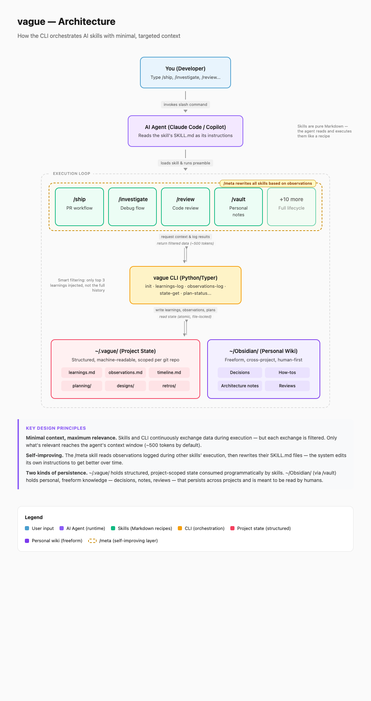

# vague

A Python/Typer CLI that acts as the filesystem contract for 21 markdown-based LLM skills covering the full software development lifecycle, from triage to retro.

Skills are markdown files. `vague` is the stable interface between them and the filesystem: skills call `vague` commands, `vague` reads and writes state under `~/.vague/`. No server, no cloud, no registry.

## Overview

- **21 slash commands** spanning planning, design, execution, reflection, and interview prep (see the Skill Map below).
- **State lives in `~/.vague/`** and is scoped per project. Skills never touch the filesystem directly.
- **Mechanical telemetry:** every skill preamble logs a usage event via `vague context --skill`, feeding `vague status`, `vague analytics-show`, and `/ops-retro` with zero agent cooperation.
- **Installs into your runtime** of choice: Claude Code, Copilot, Cursor, or Windsurf.
- **Clean layering:** `commands/` (thin Typer wrappers) → `core/` (logic) → `models.py` (pydantic). Covered by a fast test suite.

## Quickstart

```bash
git clone https://github.com/atisben/vague.git && cd vague
uv tool install . --force --reinstall
vague install          # auto-detects Claude Code, Copilot, Cursor, or Windsurf
```

Then use any slash command in your AI tool.

---

## Skill Map

### Entry point
| Command | When to use |
|---------|-------------|
| `/ops-triage` | The front door. Triage what's on your plate and route to the right skill. |

### Planning
| Command | When to use |
|---------|-------------|
| `/plan-ideation` | You have an idea. Validates it, challenges it, writes a design doc. |
| `/plan-ceo` | Pressure-test scope. Expand, hold, or reduce. |
| `/plan-eng` | Lock in architecture, data model, test strategy. |

### Design
| Command | When to use |
|---------|-------------|
| `/design-consultation` | Create a complete design system — aesthetic, typography, color, layout. |
| `/design-shotgun` | Visual brainstorm — generate 3 variants, pick one. |
| `/design-html` | Turn an approved design into production HTML/CSS. |
| `/design-review` | Visual QA on a live site — find and fix issues. |

### Execution
| Command | When to use |
|---------|-------------|
| `/dev-develop` | Orchestrate a feature across fresh-context subagents. |
| `/dev-ship` | Implement, test, commit, push, PR. |
| `/dev-review` | Pre-landing code review before merging. |
| `/dev-investigate` | Debug systematically — root cause first. |

### Reflection
| Command | When to use |
|---------|-------------|
| `/ops-learn` | Browse, search, prune, and export project learnings. |
| `/ops-retro` | Weekly engineering retrospective. |
| `/ops-meta` | Review observations and improve the skills themselves. |
| `/ops-vault` | Save and retrieve notes from your Obsidian vault. |

### Interview prep
| Command | When to use |
|---------|-------------|
| `/iv-kickoff` | Start interview coaching — profile, resume analysis, cadence. |
| `/iv-research` | Research a company, decode a JD, score the fit. |
| `/iv-stories` | Build and drill your STAR storybank. |
| `/iv-practice` | Drills and mock interviews with scoring. |
| `/iv-progress` | Trends, calibration, readiness verdict. |

---
## System design



---

## Workflow

```
/ops-triage                 → triage + route to any skill below

Idea
  └─ /plan-ideation         → design doc
      ├─ /plan-ceo          → scope decisions
      └─ /plan-eng          → architecture locked

      ├─ /design-shotgun    → pick a layout
      └─ /design-html       → production HTML

          └─ /dev-ship      → implement + PR
              └─ /dev-review → pre-landing review
                               └─ merge

                              /dev-investigate   (when bugs happen)
                              /ops-learn         (anytime)
                              /ops-retro         (end of week)
```

---

## State

All data lives in `~/.vague/`:

```
~/.vague/
├── config.md
├── analytics/
│   └── skill-usage.md      ← written mechanically by `vague context --skill`
└── projects/
    └── {owner-repo}/
        ├── project.md      ← repo path + last_seen (powers `vague status`)
        ├── learnings.md
        ├── timeline.md
        ├── retros/
        └── designs/
```

---

## CLI Reference

```bash
vague init                              # JSON context for skills (slug, branch, config, learnings)
vague context --shell --skill dev-ship  # eval-able SLUG=/BRANCH=/... + logs the usage event
vague status                            # cross-project dashboard: branches, in-flight plans
vague config-get proactive              # read config value
vague config-set proactive false        # write config value
vague learnings-log '<json>'            # append a learning
vague learnings-search --type pitfall   # filter learnings
vague analytics-show 7d                 # usage dashboard (7d | 30d | all)
vague slug                              # print SLUG= and BRANCH=
vague timeline-log '<json>'             # append session event
vague commit "msg" --files f1 f2        # atomic git commit
vague skill-validate <dir>              # validate a skill against the contract
vague skill-audit <dir> --strict        # scan for legacy bash patterns
```

---

## Telemetry

Skill usage is captured **mechanically**: the preamble every skill runs —
`eval "$(vague context --shell --skill <name>)"` — logs a usage event as a
side effect. No agent cooperation needed, no logging step a model can skip.

Each invocation records:

- a **usage event** (`skill`, `repo` slug, `branch`, `ts`) appended to
  `~/.vague/analytics/skill-usage.md` (capped at 1,000 entries, oldest evicted)
- the project's **repo path + last seen** in `~/.vague/projects/{slug}/project.md`
  — this is what lets `vague status` run git checks across all your projects

Capture is best-effort and can never break a skill: if the write fails
(read-only disk, lock contention), the error is swallowed and the context
output still prints.

### Reading it back

```bash
vague status              # cross-project dashboard: branches, in-flight plans, last activity
vague analytics-show 7d   # skill usage counts (7d | 30d | all)
```

`/ops-triage` runs `vague status` automatically as its first step, and
`/ops-retro` folds the same data into the weekly retrospective.

### Turning it off

Everything is **100% local** — nothing ever leaves your machine (see
[Telemetry](docs/telemetry.md) for the full inventory of what is and isn't
logged). To disable usage events:

```bash
vague config-set telemetry off
```

`project.md`, timeline, and learnings are structural state (they power
`vague status`, `/ops-retro`, and learning recall) and are still written.

---

## Observability

`vague` can log every command it runs (name, duration, exit code) plus any
internal errors that would otherwise be swallowed. Logging is **off by default**
and **100% local**: nothing is sent anywhere (see [Telemetry](docs/telemetry.md)).

Turn it on with the `VAGUE_LOG` environment variable:

```bash
export VAGUE_LOG=debug   # debug | info | warning | error (unset = off)
```

Logs are written to a rotating file at `~/.vague/logs/vague.log` (1 MB x 3
backups). A file is the right sink here: each skill step spawns a separate
short-lived `vague` process, and an LLM runtime captures their stderr into its
own context. The file persists across those calls so you can watch one stream.

Run the agent in one terminal and tail the log in another:

```bash
tail -f ~/.vague/logs/vague.log
```

```text
2026-06-04 14:45:19 pid=19944 INFO vague start command=slug
2026-06-04 14:45:19 pid=19944 INFO vague end command=slug exit=0 duration_ms=26.6
```

Set `export VAGUE_LOG=debug` in your shell profile so every `vague` process the
agent spawns inherits it. When running `vague` by hand, add
`VAGUE_LOG_STDERR=1` to also echo logs to your terminal.

---

## Requirements

- Python 3.11+
- `git`
- `gh` CLI (optional, for PR creation in `/dev-ship`)
- Claude Code and/or GitHub Copilot CLI

---

## Docs

- [Architecture](docs/architecture.md) — state directory, data model, skill lifecycle
- [Skill authoring](docs/skill-authoring.md) — how to write a new skill
- [Telemetry](docs/telemetry.md) — what is logged and where


## Updates

In order to reinstall the latest update of vague, use 
```bash
uv tool install . --force --reinstall
```

## Inspirations

- [gstack](https://github.com/garrytan/gstack): An ensemble of advanced skills using bash command to interract with persistent, project checkpoints
- [karpathy's wiki](https://gist.github.com/karpathy/442a6bf555914893e9891c11519de94f): A paradigm for saving persisent files to local wiki that serves as a brain for LLM supported tasks
- [get shit done](https://github.com/gsd-build/get-shit-done): A light-weight meta-prompting, context engineering, and spec-driven development system
